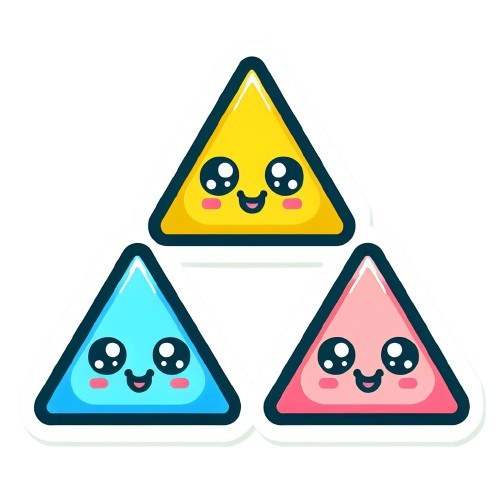
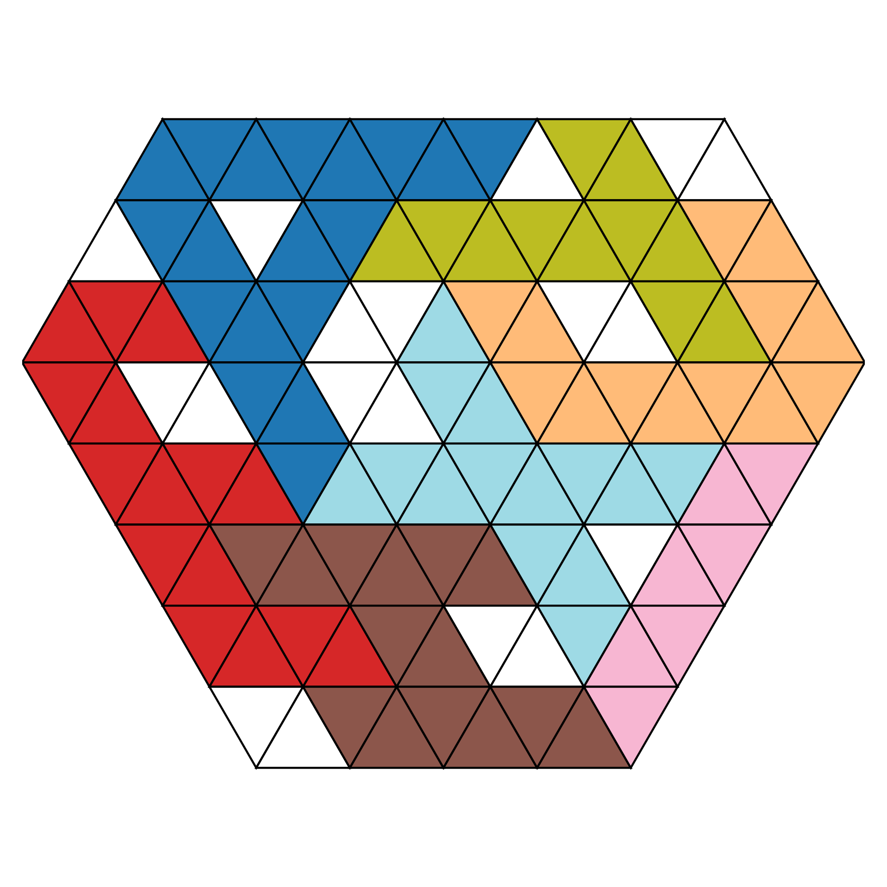

<!-- Improved compatibility of back to top link: See: https://github.com/othneildrew/Best-README-Template/pull/73 -->
<a id="readme-top"></a>
<!--
*** Thanks for checking out the Best-README-Template. If you have a suggestion
*** that would make this better, please fork the repo and create a pull request
*** or simply open an issue with the tag "enhancement".
*** Don't forget to give the project a star!
*** Thanks again! Now go create something AMAZING! :D
-->

<!-- PROJECT SHIELDS -->
<!--
*** I'm using markdown "reference style" links for readability.
*** Reference links are enclosed in brackets [ ] instead of parentheses ( ).
*** See the bottom of this document for the declaration of the reference variables
*** for contributors-url, forks-url, etc. This is an optional, concise syntax you may use.
*** https://www.markdownguide.org/basic-syntax/#reference-style-links
-->
[![Contributors][contributors-shield]][contributors-url]
[![Forks][forks-shield]][forks-url]
[![Stargazers][stars-shield]][stars-url]
[![Issues][issues-shield]][issues-url]
[![project_license][license-shield]][license-url]
[![LinkedIn][linkedin-shield]][linkedin-url]

<!-- PROJECT LOGO -->
<br />
<div align="center">
  <a href="https://github.com/ggattoni/polyamonds-puzzle-solver">
    
  </a>

<h3 align="center">Polyamonds puzzle solver</h3>

  <p align="center">
    This project aims to solve automatically puzzles whose goal is to fill a grid formed by equilateral triangular cells with pieces (typically shaped as letters) formed also by equilateral triangles, also called amonds.
    <br />
    <a href="https://github.com/ggattoni/polyamonds-puzzle-solver"><strong>Explore the docs »</strong></a>
    <br />
    <br />
    <!-- <a href="https://github.com/ggattoni/polyamonds-puzzle-solver">View Demo</a>
    &middot; -->
    <a href="https://github.com/ggattoni/polyamonds-puzzle-solver/issues/new?labels=bug&template=bug-report---.md">Report Bug</a>
    &middot;
    <a href="https://github.com/ggattoni/polyamonds-puzzle-solver/issues/new?labels=enhancement&template=feature-request---.md">Request Feature</a>
  </p>
</div>

<!-- TABLE OF CONTENTS -->
<details>
  <summary>Table of Contents</summary>
  <ol>
    <li>
      <a href="#about-the-project">About The Project</a>
      <ul>
        <li><a href="#built-with">Built With</a></li>
      </ul>
    </li>
    <li>
      <a href="#getting-started">Getting Started</a>
      <ul>
        <li><a href="#prerequisites">Prerequisites</a></li>
        <li><a href="#installation">Installation</a></li>
      </ul>
    </li>
    <li><a href="#usage">Usage</a></li>
    <li><a href="#roadmap">Roadmap</a></li>
    <li><a href="#contributing">Contributing</a></li>
    <li><a href="#license">License</a></li>
    <li><a href="#contact">Contact</a></li>
    <li><a href="#acknowledgments">Acknowledgments</a></li>
  </ol>
</details>

<!-- ABOUT THE PROJECT -->
## About The Project

<!-- [![Product Name Screen Shot][product-screenshot]](https://xtech.ai/) -->
<div align="center">
  <a href="https://xtech.ai/">
    
  </a>
</div>

After a collegue of mine took to the office a 3d printed puzzle to solve, the entire office productivity dropped trying to solve the puzzle for the glory. Even though the puzzle was solved after a few weeks, I was curious to implement a solver that can quickly get the solution of the puzzle.

<!-- <p align="right">(<a href="#readme-top">back to top</a>)</p> -->

### Built With

* [![Python][Python]][Python-url]
* [![Ruff][Ruff]][Ruff-url]

<!-- <p align="right">(<a href="#readme-top">back to top</a>)</p> -->

<!-- GETTING STARTED -->
## Getting Started

To get a local copy up and running follow these simple example steps.

### Prerequisites

* Install uv by following the instructions on [uv's docs](https://docs.astral.sh/uv/getting-started/installation/)

### Installation

1. Clone the repo
   ```sh
   git clone https://github.com/ggattoni/polyamonds-puzzle-solver.git
   ```
2. Install the repo
   ```sh
   uv sync
   ```
3. Change git remote url to avoid accidental pushes to base project
   ```sh
   git remote set-url origin ggattoni/polyamonds-puzzle-solver
   git remote -v # confirm the changes
   ```

<!-- <p align="right">(<a href="#readme-top">back to top</a>)</p> -->

<!-- USAGE EXAMPLES -->
## Usage

In order to solve a puzzle, use the following command:
```
gla-puzzle solve <puzzle_name>
```
By default, the solver used is a CP-SAT solver, but it can also be selected the brute force algorithm (keep in mind that it is quite slow with respect to the CP-SAT solver)
```
gla-puzzle solve -s brute-force <puzzle_name>
```

<!-- _For more examples, please refer to the [Documentation](https://example.com)_ -->

<!-- <p align="right">(<a href="#readme-top">back to top</a>)</p> -->

<!-- ROADMAP -->
## Roadmap

- [x] Brute-force solver
- [x] SAT solver
- [x] Remove SymPy to improve performances
  - [x] Use as units x=0.5 and y=sqrt(3)/2
- [x] Create CLI
- [ ] Interface to define grid and pieces faster
  - [ ] Move piece and grid configuration to JSON format
  - [ ] Create symmetries and rotations at save time and save to JSON

See the [open issues](https://github.com/ggattoni/polyamonds-puzzle-solver/issues) for a full list of proposed features (and known issues).

<!-- <p align="right">(<a href="#readme-top">back to top</a>)</p> -->

<!-- CONTRIBUTING -->
## Contributing

Contributions are what make the open source community such an amazing place to learn, inspire, and create. Any contributions you make are **greatly appreciated**.

If you have a suggestion that would make this better, please fork the repo and create a pull request. You can also simply open an issue with the tag "enhancement".
Don't forget to give the project a star! Thanks again!

1. Fork the Project
2. Create your Feature Branch (`git checkout -b feature/amazing_feature`)
3. Commit your Changes (`git commit -m 'feat: add some amazing feature'`)
4. Push to the Branch (`git push origin feature/amazing_feature`)
5. Open a Pull Request

<!-- <p align="right">(<a href="#readme-top">back to top</a>)</p> -->

<!-- ### Top contributors:

<a href="https://github.com/ggattoni/polyamonds-puzzle-solver/graphs/contributors">
  
</a> -->

<!-- LICENSE -->
## License

Distributed under the MIT license. See [`LICENSE.txt`](LICENSE.txt) for more information.

<!-- <p align="right">(<a href="#readme-top">back to top</a>)</p> -->

<!-- CONTACT -->
## Contact

Giacomo Gattoni - ggattoni3@gmail.com

<!-- Project Link: [https://github.com/ggattoni/polyamonds-puzzle-solver](https://github.com/ggattoni/polyamonds-puzzle-solver) -->

<!-- <p align="right">(<a href="#readme-top">back to top</a>)</p> -->

<!-- ACKNOWLEDGMENTS -->
## Acknowledgments

* [Glauco Uri](https://github.com/glaucouri) and his father for creating these amazing puzzles.

<!-- <p align="right">(<a href="#readme-top">back to top</a>)</p> -->

<!-- MARKDOWN LINKS & IMAGES -->
<!-- https://www.markdownguide.org/basic-syntax/#reference-style-links -->
[contributors-shield]: https://img.shields.io/github/contributors/ggattoni/polyamonds-puzzle-solver.svg?style=for-the-badge
[contributors-url]: https://github.com/ggattoni/polyamonds-puzzle-solver/graphs/contributors
[forks-shield]: https://img.shields.io/github/forks/ggattoni/polyamonds-puzzle-solver.svg?style=for-the-badge
[forks-url]: https://github.com/ggattoni/polyamonds-puzzle-solver/network/members
[stars-shield]: https://img.shields.io/github/stars/ggattoni/polyamonds-puzzle-solver.svg?style=for-the-badge
[stars-url]: https://github.com/ggattoni/polyamonds-puzzle-solver/stargazers
[issues-shield]: https://img.shields.io/github/issues/ggattoni/polyamonds-puzzle-solver.svg?style=for-the-badge
[issues-url]: https://github.com/ggattoni/polyamonds-puzzle-solver/issues
[license-shield]: https://img.shields.io/github/license/ggattoni/polyamonds-puzzle-solver.svg?style=for-the-badge
[license-url]: https://github.com/ggattoni/polyamonds-puzzle-solver/blob/master/LICENSE.txt
[linkedin-shield]: https://img.shields.io/badge/-LinkedIn-black.svg?style=for-the-badge&logo=linkedin&colorB=555
[linkedin-url]: https://linkedin.com/in/giacomo-gattoni
[product-screenshot]: assets/images/xtechai.png
[Python]: https://img.shields.io/badge/python-3776AB?style=for-the-badge&logo=python&logoColor=white
[Python-url]: https://www.python.org/
[SymPy]: https://img.shields.io/badge/sympy-3B5526?style=for-the-badge&logo=sympy&logoColor=white
[SymPy-url]: https://www.sympy.org/
[Ruff]: https://img.shields.io/badge/ruff-D7FF64?style=for-the-badge&logo=ruff&logoColor=black
[Ruff-url]: https://docs.astral.sh/ruff/